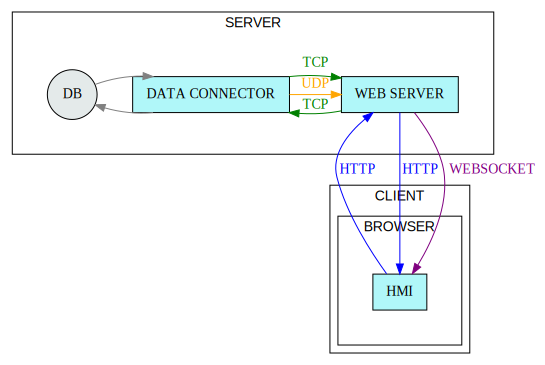
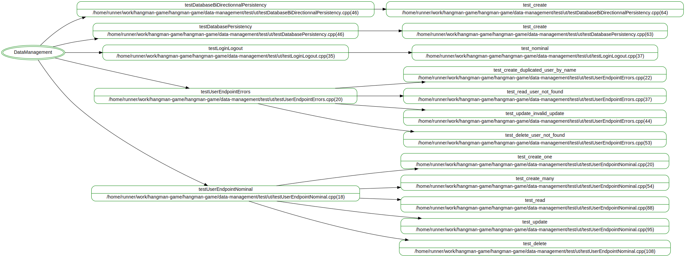

# Règles de développement

## Gestion de la qualité 

### Métriques à suivre :

- Couverture de code
- Duplication de code
- Les options de compilation doivent être actives (typescript et c++)
- Le code doit être uniforme (formateurs prettier et clang-format)
- La qualité doit correspondre aux recommandations du langage (linter eslint et clang-tidy+cppcheck)
- Les conceptions et rapports doivent être conservés
- L’analyse de la qualité doit être rapidement démontrable (automatisation et agrégation des résultats sur SonarCloud).
- Les composants et les fonctions doivent être typées et avoir des performances acceptables

## Stratégie de conception des composants.

### Liste des composants.

1. La base de données (SQLite, MySQL, PostgreSQL, ...).
2. Le model de données (lib-ODB).
3. Le connecteur de base de données, le serveur TCP qui sert de couche d'abstraction de la base de données qui prend de l'XML en entrée et retourne les résultats en XML.
4. Le serveur Web qui sert les fichiers statiques de l'IHM et fournit une interface HTTP vers la base de données avec une API REST.
5. La documentation de l'application et des interfaces.
6. Les pages Web qui forment l'IHM pour fournir l'interface utilisateur.

### Ordonnancement des conceptions.

> **Règle numéro 1:** Les données doivent toujours être considérées comme des éléments pivot de l'application, c'est le cycle de vie de la données qui impose les comportements et les contraintes IHM.

- (2) Le model et les modificateurs d'objets persistés sont générés à partir du déclaratif des classes.
- (3) Les points d'entrée du connecteur de base de données sont générés à partir d'un fichier déclaratif et d'un script pour activer les comportements classiques (CRUD), les comportements spécifiques sont à créer et tester manuellement.
- (4) Les points d'entrée du serveur HTTP sont générés en même temps que les points d'entrée du connecteur de base de données pour les interfaces classique (CREATE = POST, READ = GET/POST, UPDATE = PUT/PATCH, DELETE = DELETE).
- (5) La documentation des API HTTP est généré à partir du fichier déclaratif qui est à l'origine des points d'entrée HTTP.
- (6) Les formulaires de l'IHM utilisent la documentation JSON des API HTTP pour leurs constructions.

> Utiliser cette génération centralisée permet de garantir l'unicité des comportements autour de la données. 

## Diagramme de déploiement

## Conception du model

| Object-Type     | Description                                                                        | Relations                       |
| :-------------- | :--------------------------------------------------------------------------------- | ------------------------------- |
| User            | Les objets utilisateurs pour la connexion à l'application.                         | 1 User appartient à 1 à N Group. 1 User peut avoir 0 à N User en amis. 1 User participe à 0 à N Party |
| Group           | Les group d'utilisateurs pour les restrictions d'application.                      | 1 Group contient plusieurs User |
| Dictionary      | Le dictionnaire pour regrouper les mots par langues.                               |                                 |
| Word            | Les mots pour le jeu du pendu.                                                     |                                 |
| Party           | Les parties jouées.                                                                |                                 |
| Message         | Les messages entre joueurs.                                                        |                                 |
| Chat            | Les chats sont les discutions entre User ou Team.                                  |                                 |
| Team            | Les regroupements de joueur pour les parties de groupe et les messages.            |                                 |

## Stratégie des scripts.

Les scripts ont pour objectif d’automatiser les tâches récurrentes ou complexes.

Les scripts doivent remplir la liste d’obligations suivante :

- Le script doit pouvoir être utilisé sur tous les plus grand OS
- Le script doit utiliser le moins de ressource possible
- Le script doit pouvoir être utilisable par CLI simplement
- Le script doit pouvoir être importé par un autre script
- Le script doit fournir un mode d’emploi
- Le script doit être configurable
- Le script doit être testé (s’il comporte de l’algorithmique)
- Le script doit être documenté
- Le script doit retourner un code d’erreur en cas d’échec
- Le script doit pouvoir passer sous silence son code d’erreur
- Le script doit pouvoir fournir des logs en quantité suffisante
- Le script doit fournir un modificateur de verbosité des logs
- Le script doit être commenté en quantité suffisante

## Stratégie de log

Les logger doivent remplir la liste d’obligations suivante :

- Le logger doit être extensible
- Le logger doit fournir des appenders en quantité suffisante
- Le logger doit fournir un parser générique extensible
- Le logger doit être configurable

> Le format de log générique est le suivant :
>
> - La date : `YYYY-MM-DD hh:mm:ss.mmm`
> - Le niveau du log : `DEBUG`, `INFO`, `WARN`, `ERROR`, `FATAL`
> - Le nom du thème (nom de script/nom de fonction, nom de partie) :
> - Le protocole : `[HTTP]`, `[TCP]`, `[SMTP]`, `[IO]`
> - Le message : format libre

## Organisation des tests

### Objectifs

Les tests ont pour objectif de garantir que le fonctionnement du code est conforme à ce qui est attendu, la granularité des tests varie du test le plus précis (les tests unitaires) au test plus global (le test de fumée).

### Critères de validation d’un test

Pour être de qualité un test doit :

- Être simple à relire
- Être correctement documenté
- Avoir un attendu clair
- Avoir un périmètre défini et restreint
- Avoir des assertions utiles et susceptibles d’échouer en cas de régression ou de dysfonctionnement
- Être rejouable sans action manuelle (qu’il soit échoué ou réussi)
- Ne pas être dépendant d’un autre test
- Laisser un environnement de test propre après exécution.

### Types de test

Type de test ordonnés par priorité :

- **Test unitaire**, les nouvelles fonctionnalités développées doivent être testées en prenant en compte un maximum de cas potentiels pour un périmètre restreint.

- **Test d’intégration**, la compatibilité des différentes parties du logiciel est vérifié par les tests d’intégration. Les tests d’intégration ne vérifient pas l’intégralité des branches du codes déjà couvertes par les tests d’intégration mais le bon fonctionnement des échanges de chaque composant.

- **Test de fumée**, les fonctionnalités sont vérifiées à partir des accès utilisateurs sur le logiciel complet en réalisant des parcours utilisateurs nominaux pour vérifier la conformité du logiciel avec le cahier des charges initiales

Sujets de test :

- **Test IHM** (intégration, fumée), l’objectif du test est de garantir la conformité des comportement de l’IHM avec l’attendu, qu’il s’agisse du point de vue graphique (saisie de formulaire, transition, placement) ou réseau (entrées/sorties HTTP).

- **Test d’API** (intégration) les API exposées doivent être conformes à la documentation publiée en terme de ressources fournies et reçues. Les tests sont rédigés et maintenu à partir de la documentation produite

- **Test de performance IHM** (fumée) la réactivité de l’IHM est mesurée à partir du temps de chargement initiale (chargement des sources et des données), de la vitesse de rafraîchissement de la page (avec cache), de la réactivité de la mise à jour graphique local (sans rafraîchissement)

- **Test de performance Server** (intégration) la performance du serveur se mesure à partir du nombre de demande pouvant être traitée simultanément pour des requêtes simple, le temps de persistance d’un nombre de données (jeu de données fixe avec un nombre de relation entre objets identifiés)

### Règle communes

Les fonctionnalités doivent être testées de manière suffisantes avec un objectif de couverture de code > 80%, pour se faire la planification de TDD est à mettre en place.

Les tests doivent être utile en testant des implémentations de code représentant des fonctionnalités attendu des projets, on ne test pas les petites fonctions mais les fonctions significatives (utilisant des algorithmes complexes ou faisant appelle à d’autres fonctions) 

En prenant de la hauteur on identifie le code « mort » et on peut l’éliminer rapidement 

### Tests client

Les fonctionnalités qui ne sont pas graphiques sont à tester avec un environnement Front allégé (sans DOM)

Les fonctionnalités graphiques sont à tester sur un résultat du code source en version de dev ou en version bundle (en version de deg de préférence pour collecter la couverture de code).

Pour les interfaces complexes (notamment la partie réseaux) il est possible de fournir des utilitaires de test pour simplifier les futures tests.

### Tests serveur

Les API REST proposées par le serveur doivent être testé avec un utilitaire facilement maintenable.

Les exceptions de mauvaise configuration et mauvais lancement doivent être testées, les traces dans la console ou les logs doivent être suffisantes pour comprendre l'origine du mauvais usage.

### Tests models

le model est testé de 3 façon : 

  - par des **tests unitaires** du connecteur de base de données.
  - par des **tests d'intégration IHM** à partir de parcours utilisateur pour tester les données sortantes en HTTP.
  - par des **tests d'intégration/interface serveur** pour tester ce qui rentre/sort en HTTP.

## Convention de syntaxe : 

### Convention de composition

Les fichiers, les variables, méthodes, classes, interfaces ne doivent pas contenir :
  - d’accent
  - d’espace
  - de caractère spéciaux

Les variables, méthodes, classes, interfaces doivent commencer par une lettre.

### Les préfix

  - _ avec un underscore on déclare que l’attribue ou la fonction ne doit pas être utilisée.
  - E avec un « E » majuscule devant le nom des énumérés
  - I avec un « I » majuscule devant le nom des interfaces

### Les suffixes

  - _t Pour les déclarations de types c++

### Les extensions

  - pour les images on privilégie les .svg et les .png
  - pour les fichiers HTML on utilise uniquement.html et non pas .htm
  - pour les fichiers de style on privilégie les .scss
  - pour les fichiers TypeScript on utilise l’extension .tsx pour les fichiers contenant de la notation TSX, sinon .ts
  - pour les fichiers markdown on utilise l’extension .md 

On n’utilise pas de JavaScript sauf pour les configurations ne supportant le TypeScript

### Convention de casse

#### SNAKE CASE

Les fichiers ressources (png, svg, pdf, json, etc...)

#### SCREAMING SNAKE CASE

- Les constantes de configuration 
- Les constantes exportées
- Les clés de traduction
- Les énumérer 

#### CAMEL CASE

- Les variables
- Les fonctions 

#### UPPER CAMEL CASE

- Les fichiers des classes
- Les classes
- Les interfaces
- Les composants React

#### Cas particuliers :

Si possible éviter les majuscules pour les noms des fichiers (sauf quand le nom du fichier reprend le nom de son contenu)

Les fichiers de police de caractère suive le nom de la police avec son style et sa graisse,

> Exemple : pour une police « Nunito Sans » en italique avec une graisse de 300 donnerait Nunito-Sans_Italic_Light.svg
